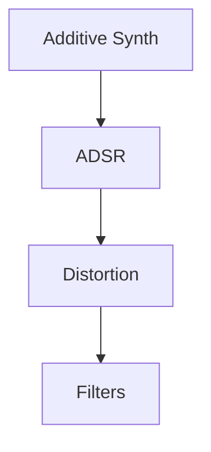

# Interactive Web Apps with RNBO

## Summary
This project is a template/demo for building interactive audio web apps using RNBO (by [Cycling '74](https://rnbo.cycling74.com/)), browser-based technologies, and smartphone motion sensors. It includes a custom RNBO synth MAX MSP patch, a minimal website UI, a p5.js sequencer, and real-time sensor mapping.

## Prerequisite Knowledge

MAX MSP + RNBO  
IDE/Text Editor  
Browser (Chrome, Firefox, Safari, etc)     

## Programming concepts and methods

The main framework consists of 3 main components,
### RNBO

RNBO is a platform developed by Cycling '74 for creating portable, real-time audio processing patches. It allows users to design audio effects and instruments in Max, export them as code, and run them efficiently in web browsers, embedded devices, or other environments. RNBO enables seamless integration of interactive audio features into web applications.

Find out more [here.](https://rnbo.cycling74.com/)

For the sake of this demo, I have put together a basic synth patch with simple effects. 



There are more details of each component inside the RNBO Patch file. 


### Website (HTML + JS)

The website is built off of [rnbo.example.webpage](https://github.com/Cycling74/rnbo.example.webpage).

I have removed most of the default UI and only left the parameter sliders. 
Changes included:
1) Removing unwanted UI div's from index.html
2) Removing unwanted function calls from app.js, The main structure of app.js was not removed to allow further exploration of how certain rnbo features can be utilised on web. 

### p5.js 

A simple p5.js implementation was added app.js to draw a seqencer. Here is the same in a [p5.js editor](https://editor.p5js.org/yashiquechalil/sketches/cM46NDeF9) that you can tweak around. 


### Smartphone Sensor Reading

The RNBO web inference can be interfaced with motion and haptic sensors available on smartphones. This can be used to create interactive/gestural music controllers. For this example I have set up a simple example of the same. The smartphones orientation motion sensors have been scaled and mapped to a few paramters in the RNBO patch using WEB API's.

[Web API for device orientation event](https://developer.mozilla.org/en-US/docs/Web/API/Window/deviceorientation_event)

alpha (α) – rotation around z‑axis (twist):
  - 0° when the top points North, increasing counterclockwise (90° = West) 

beta (β) – rotation around x‑axis (tilt forward/back):
  - Range: –180° (backwards) to +180° (forwards)

gamma (γ) – rotation around y‑axis (tilt left/right):
  - Range: –90° (left) to +90° (right)

[Read More here](https://developer.mozilla.org/en-US/docs/Web/API/Device_orientation_events/Orientation_and_motion_data_explained)

Note: In most smartphones sensors can only be accessed by a website with a users input to activate it. In this code we have a button setup to start the audioContext which then also starts listening to various sensors that have been setup.

### Directions to setup

To-do (Explain further)
1) Clone Repo
2) To setup the website, open a terminal in the project directory. 
```
cd <user directory>/teaching-programming-music-with-code/code resources/Yash/Web
```
3) set up ssl certificate 
  Browsers block access to sensitive APIs like sensors on non-secure (HTTP) origins. To use HTTPS with your local RNBO site (especially to access phone sensors like orientation/motion), you'll need to serve it over HTTPS rather than HTTP. 
  You can run http-server with HTTPS by generating a self-signed certificate:
  
  Step 1: Generate SSL certificate and key
  In your terminal console, run:
  ```
  mkdir ssl
  openssl req -new -x509 -keyout ssl/key.pem -out ssl/cert.pem -days 365 -nodes
  ```
  Note: Just press Enter through the questions.
  
  Step 2: Run http-server with HTTPS
  ```
  npx http-server -S -C ssl/cert.pem -K ssl/key.pem
  ```

4) Open the link local IP (192.168.x.x:<portNumber>)
   Make sure to open the site with https for example, https://192.168.3.24:8080


## How this resource could be used

Use this as a learning template or a starting point to create Music synthesisers, audio effects or any audio visual applications with RNBO and quickly turn the same into an interactive instrument on that can sit on your phone and can also be shared on with your friends or even host on your website as an interactive section. 

## How could this be taken further

This concept can be used in a wide variety of web based applications, 
1) Live installations
2) Live shows invovling audience participation
3) Creating gestural instruments
4) Live audio FX tools, and so on.

## Technical Resources or Requirements

